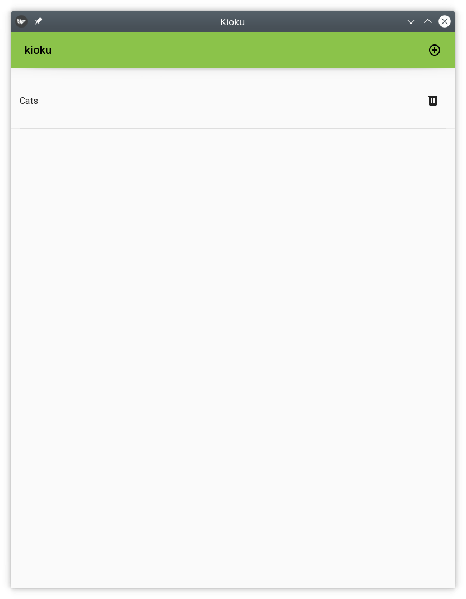
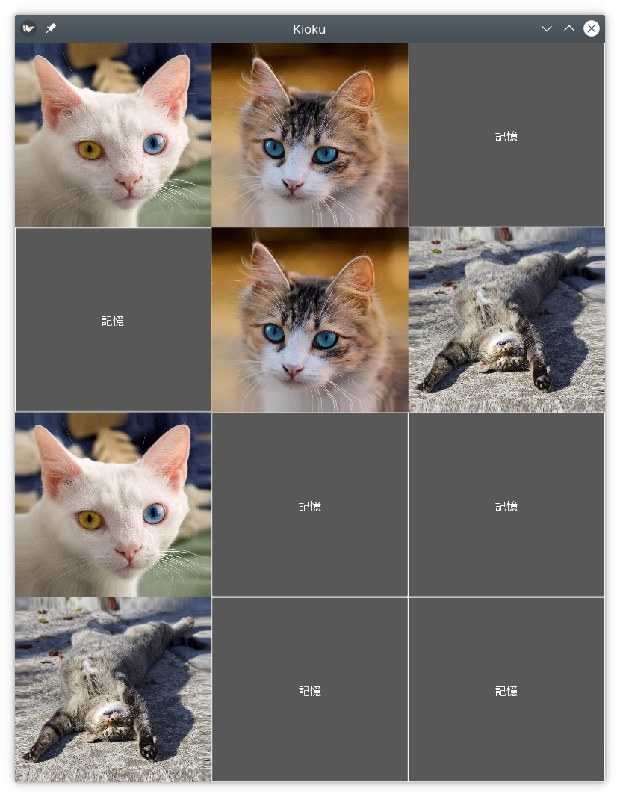

kioku (記憶)
============

kioku is a simple and customizable memory game where you can create your own
levels. It's written in Python and released under the GPL3.

It can be installed both on Linux and Android.

Here you can see a `video of the game on Android`_.

.. _video of the game on Android: https://peertube.debian.social/videos/watch/be2960fa-d65f-4ead-901a-71d71e34f21f

Installation
------------

Dependencies are managed by `python poetry`_ so make sure to have it installed.

.. _python poetry: https://python-poetry.org/

Linux
^^^^^

#. Clone the repository from https://noa.mornie.org/eriol/kioku
#. Install the dependencies using ``poetry install``
#. Build the project using ``poetry build``
#. Install the wheel or the sdist you will find in ``dist/`` directory
#. Run the ``kioku`` command from CLI

Android
^^^^^^^

#. Clone the repository from https://noa.mornie.org/eriol/kioku
#. Install the dependencies using ``poetry install``
#. Build the Android app using ``poetry run buildozer -v android debug`` (beware
   that first time `buildozer`_ will download Android SDK, NDK and other stuff,
   it will take time)
#. Install the apk you will find in ``bin/`` directory

.. _buildozer: https://buildozer.readthedocs.io/en/1.2.0/

Create a new level
------------------

To create a kioku's level you only need to add **JPG** images into a **ZIP**
archive. However doing so, you will get a grid with 3 columns and the name of
the level will be `Unknown`.

To configure both the name and the columns include a `metadata.toml` file inside
the **ZIP** file with the following:

.. code:: toml

   name = "My wonderful level"
   columns_number = 4

Load a level
------------

Press the button on top right of the toolbar (the plus symbol circled) and
select the **ZIP** file using the file browser that will appear.

Gallery
-------

   The main screen of kioku on Linux.

   The game screen of kioku on Linux playing a level with cats' images.

The images used are cropped version of the following images released under
Creative Commons licenses:

* `<https://commons.wikimedia.org/wiki/File:Tabby_cat_with_blue_eyes-3336579.jpg>`_
* `<https://commons.wikimedia.org/wiki/File:Sleeping_cat_on_her_back.jpg>`_
* `<https://commons.wikimedia.org/wiki/File:June_odd-eyed-cat_cropped.jpg>`_
